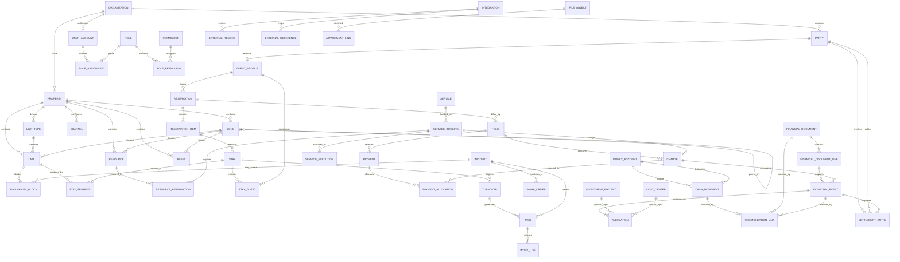

# OSG — Logical ERD v0.1

Status: proof-of-model
Data: 2026-09-14

## Cel

Logiczny model relacyjny OSG przed zamrożeniem fizycznego schematu PostgreSQL. Diagram pokazuje główne agregaty i relacje; nie jest jeszcze pełnym DDL.

## Agregaty

- Organization
- Property
- Reservation
- Stay
- Folio
- ServiceBooking
- Turnover
- Incident
- EconomicEvent
- Settlement

## Reguły granic agregatów

1. Zmiany wewnątrz agregatu preferują transakcję ACID.
2. Reakcje pomiędzy agregatami preferują Domain Events i idempotentne automatyzacje.
3. Nie tworzymy globalnych transakcji obejmujących cały system.
4. Krytyczne invariants finansowe są egzekwowane przed POSTED.
5. Availability i occupancy posiadają ochronę przed konfliktami czasowymi.

## Relacje wymagające szczególnej implementacji PostgreSQL

- brak nakładających się aktywnych StaySegments dla Unit,
- brak przekroczenia capacity ResourceReservation,
- cross-tenant FK prohibition,
- suma Allocations = EconomicEvent.amount,
- PaymentAllocation <= dostępna wartość Payment,
- uniqueness ExternalReference.

## Wnioski

Model jest wystarczająco spójny do stworzenia pierwszego fizycznego schema draft. Największe ryzyka pozostają w temporal constraints, finansowym posting workflow i integracji danych z zewnętrznym PMS.